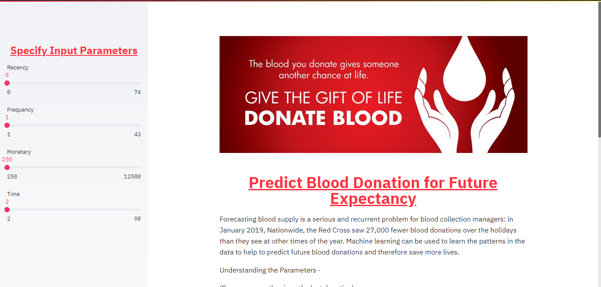
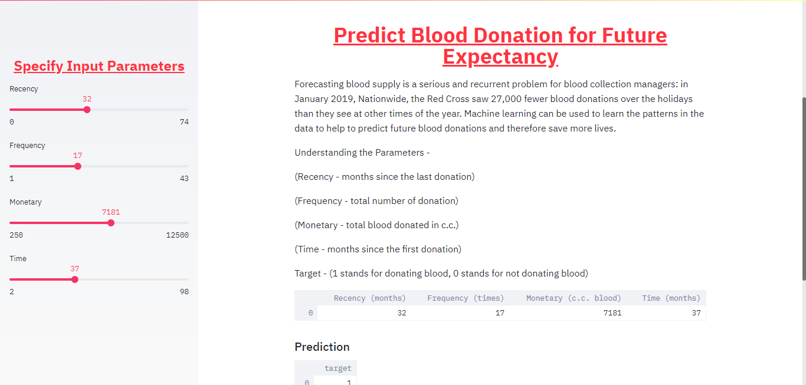
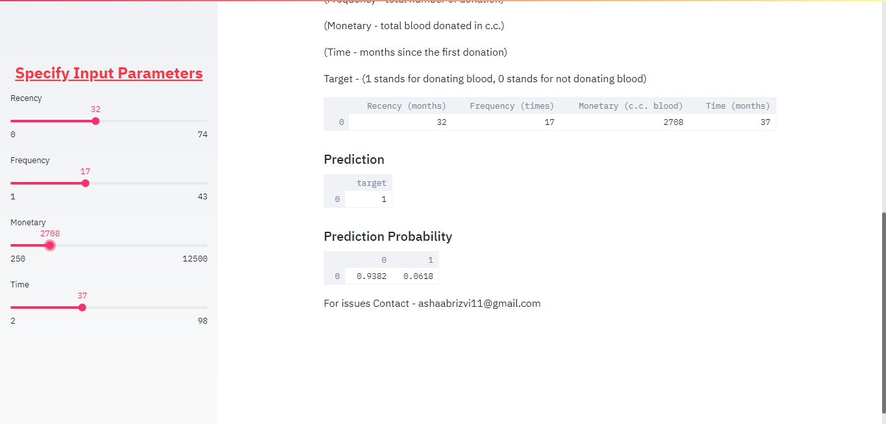

# Predict Blood Donation for Future Expectancy

Have a look at the deployed app on AWS EC2 Instance-

https://bit.ly/2Fap4D2

# Problem Statement - 

Forecasting blood supply is a serious and recurrent problem for blood collection managers: in January 2019, "Nationwide, the Red Cross saw 27,000 fewer blood donations over the holidays than they see at other times of the year." Machine learning can be used to learn the patterns in the data to help to predict future blood donations and therefore save more lives.

In this Project, you will work with data collected from the donor database of Blood Transfusion Service Center in Hsin-Chu City in Taiwan. The center passes its blood transfusion service bus to one university in Hsin-Chu City to gather blood donated about every three months. The dataset, obtained from the UCI Machine Learning Repository, consists of a random sample of 748 donors. Your task will be to predict if a blood donor will donate within a given time window. You will look at the full model-building process: from inspecting the dataset to using the tpot library to automate your Machine Learning pipeline.

Here, The model used is Logistic Regression as we have select the model using TPOT library. TPOT is a Python Automated Machine Learning tool that optimizes machine learning pipelines using genetic programming.

# Parameters

In App, Specify the Input Parameters i.e are ,

(Recency - months since the last donation)

(Frequency - total number of donation)

(Monetary - total blood donated in c.c.)

(Time - months since the first donation) and the result be the Target i.e

Target - (1 stands for donating blood; 0 stands for not donating blood).

Also, along with prediction prediction probability is also specified.

# Screenshots

Here are some screenshots from the app.

